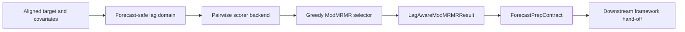

<!-- type: explanation -->
# Lag-Aware ModMRMR

Lag-Aware ModMRMR is the deterministic sparse covariate-lag selector that sits
between covariate screening and the `ForecastPrepContract` hand-off. It answers
one narrow forecastability-triage question: which lagged covariates are both
forecast-safe and still novel after accounting for already-selected features?

> [!IMPORTANT]
> mRMR and lag-aware / temporal mRMR-style selection are established.
> ModMRMR is a project-defined mRMR variant proposed by Adam Krysztopa.
> This project's contribution is the forecast-safe lag-domain construction plus
> multiplicative maximum-similarity suppression against already-selected
> features.

## Position in the Triage Workflow

The selector is upstream of modeling. It produces deterministic evidence about
legal lags, selected lags, rejected lags, and scorer diagnostics, then stops at
the hand-off boundary. It does not fit forecasting models and it does not ship
framework adapters.

## Forecast-Safe Legality

For ordinary measured covariates, a lag $k$ is legal only when

$$
k \ge \text{forecast\_horizon} + \text{availability\_margin}
$$

This legality check is applied before any scoring. Illegal measured lags are
recorded as blocked rows and never enter the scorer pool.

Known-future covariates are the explicit bypass. When a covariate is declared
with valid provenance such as calendar, schedule, contractual, or forecasted
input, the ordinary cutoff does not apply to that covariate's lag rows. This is
what lets a calendar-like driver remain usable at low lags without pretending
that realized future measurements are legal.

> [!WARNING]
> The known-future bypass is a provenance rule, not a convenience flag. Realized
> future observations are not known-future and must not be entered through this
> path.

The same forecast-safety rule also governs target-history novelty lags. If
target-history scoring is enabled, the target lags used for that novelty check
must satisfy the same cutoff.

## Target-History Novelty Penalty

The optional target-history term asks a different question from raw relevance:
does a candidate add information beyond the target's own legal history, or is
it mainly a proxy for target lags that the downstream model would already be
allowed to use?

When the novelty penalty is enabled, the shipped selector uses

$$
\text{final\_score} = \text{relevance}
\times (1 - \text{max\_redundancy})
\times (1 - \text{target\_history\_redundancy})
$$

When target-history scoring is disabled, the third factor is omitted.

This keeps the logic forecast-safe in two ways:

- the legality filter stops illegal target lags from entering the novelty set
- the novelty term downweights exogenous rows that mostly duplicate permitted
  target-history structure rather than adding new forecasting signal

## Catt-Style Scorer Backend vs Selector Logic

Lag-Aware ModMRMR separates pairwise scoring from greedy selection.

- The scorer backend decides how pairwise dependence is measured.
- The selector logic decides how those scores are turned into a deterministic
  relevance-first sparse lag set.

This means the same selector logic can run with different shipped scorer modes,
including simple rank-correlation baselines, `mutual_info_sklearn`, and the
Catt-style `catt_knn_mi` KSG backend.

The Catt-style backend matters because it keeps the dependence estimator aligned
with the AMI lineage already present in the repository. But swapping scorers
does not change the legality rule, the known-future bypass, the tie-breaking
rules, or the multiplicative suppression logic. The backend is method-specific;
the selector remains method-agnostic.

## Maximum Redundancy vs Aggregate Redundancy

The shipping selector uses maximum redundancy against the already-selected set,
not an aggregate redundancy summary over all selected rows and not any penalty
against the full candidate pool.

That choice is deliberate.

- Maximum redundancy answers whether one already-selected feature is near enough
  to a duplicate that the new candidate should be suppressed.
- Aggregate redundancy can dilute that signal when a single near-duplicate is
  averaged together with several weakly related selected rows.
- Full-pool redundancy is even further from the greedy-selection question,
  because candidates that have not been selected should not be allowed to act as
  the suppression reference.

In this project's ModMRMR formulation, the contribution is not that redundancy
matters at all. mRMR-style redundancy control is established. The contribution is
that the legal lag domain is forecast-safe and that the multiplicative penalty
uses maximum similarity against the already-selected set only.

## Why the Hand-Off Stops at ForecastPrepContract

After selection, the repository preserves the real sparse `(covariate, lag)`
choices in the framework-neutral hand-off surface. `ForecastPrepContract` can
retain typed covariate rows, lagged feature names, known-future provenance, and
target-history novelty context without claiming how any particular downstream
library should be configured.

That stop point is intentional.

- The core package stays framework-agnostic.
- The deterministic result remains reviewable as typed data.
- Downstream recipes can translate the same selected rows into external
  frameworks without moving framework dependencies into the core repo.

For the concrete hand-off translation pattern, see
[../recipes/forecast_prep_to_external_frameworks.md](../recipes/forecast_prep_to_external_frameworks.md).
For the concrete module map, see
[../code/lag_aware_mod_mrmr.md](../code/lag_aware_mod_mrmr.md).