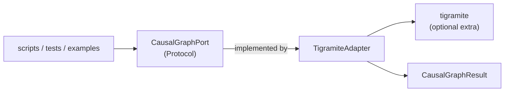
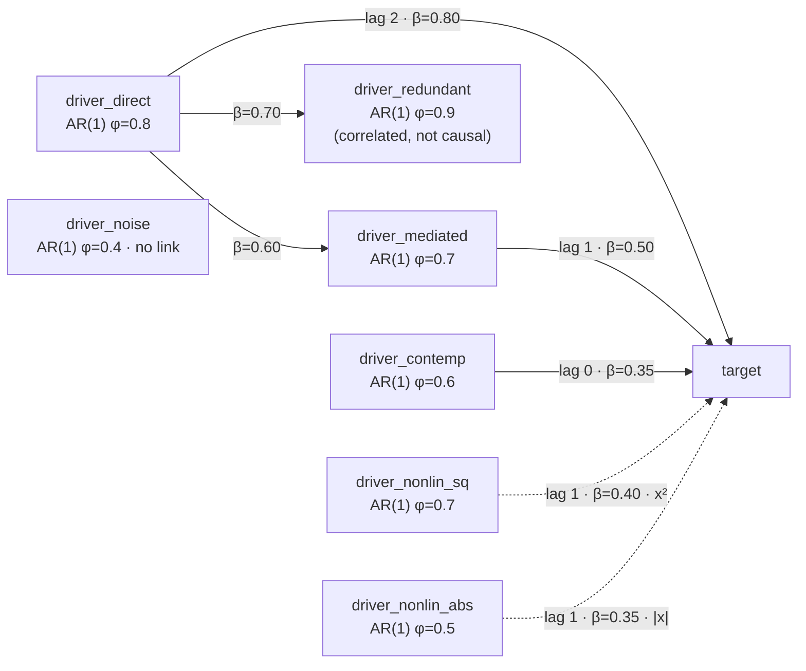
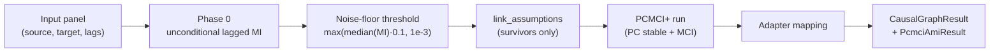

<!-- type: explanation -->
# PCMCI+ and the Tigramite Adapter

## What PCMCI+ is

PCMCI+ is a constraint-based causal discovery algorithm for multivariate time series,
introduced by Runge (2020). It extends the PC algorithm and MCI test to recover both
lagged and contemporaneous causal links in the presence of strong autocorrelation.

### Two structural phases

**Phase 1 — Lagged skeleton (PC₁ step)**

For each variable pair $(X, Y)$, PCMCI+ iteratively prunes candidate lagged parents
by running conditional independence (CI) tests against growing subsets of past states:

$$X_{t-h} \perp\!\!\!\perp Y_t \;\Big|\; \mathbf{S},\quad \mathbf{S} \subseteq \widehat{\mathcal{P}}(Y_t)$$

The skeleton grows until no further pruning is possible, avoiding the combinatorial
explosion of exhaustive parent-set search.

**Phase 2 — Momentary Conditional Independence (MCI) test**

For each candidate link $X_{t-h} \to Y_t$, the MCI test conditions on lagged parents
of *both* variables:

$$X_{t-h} \perp\!\!\!\perp Y_t \;\Big|\; \mathcal{P}(Y_t)^{\setminus h},\; \mathcal{P}(X_{t-h})$$

where $\mathcal{P}(Y_t)^{\setminus h}$ is the parent set of $Y$ excluding $X$ at lag $h$,
and $\mathcal{P}(X_{t-h})$ is the parent set of $X$.

This double conditioning is the key innovation: it removes autocorrelation-driven false
positives that arise when both series share a common autocorrelated driver.

For contemporaneous links ($h = 0$), the same MCI test applies — the algorithm tests
whether $X_t$ and $Y_t$ remain dependent after conditioning on the lagged parents of
both, thereby distinguishing genuine instantaneous interaction from autocorrelation
carryover.

> [!IMPORTANT]
> The MCI double conditioning is what distinguishes PCMCI+ from pairwise MI screening
> or cross-correlation. Without it, even independent autocorrelated processes produce
> a dense web of spurious lagged associations.

## How this project wraps it

`TigramiteAdapter` in `src/forecastability/adapters/tigramite_adapter.py` wraps the
optional `tigramite` library behind the `CausalGraphPort` hexagonal port and maps
tigramite's raw graph arrays to `CausalGraphResult`.

> [!NOTE]
> `tigramite` is an optional dependency. Install it with:
> ```
> pip install forecastability[causal]
> ```
> or, with uv:
> ```
> uv sync --extra causal
> ```

### Hexagonal boundary



`TigramiteAdapter` satisfies `CausalGraphPort` structurally (duck-typing via Protocol)
rather than via explicit inheritance. Because `CausalGraphPort` is `@runtime_checkable`,
`isinstance(adapter, CausalGraphPort)` returns `True` at runtime without inheritance.

### CI test backends

The adapter supports three CI test backends, selected at construction time:

| `ci_test` | Backend | Significance | Detects nonlinear |
|---|---|---|---|
| `"parcorr"` (default) | Partial correlation | Analytic $t$-test | No |
| `"gpdc"` | Gaussian process distance correlation | Analytic | Yes |
| `"cmiknn"` | CMI via $k$-nearest neighbours ($k=8$) | Shuffle test | Yes |

## The 8-variable synthetic benchmark

`generate_covariant_benchmark` in `src/forecastability/utils/synthetic.py` produces
a ground-truth 8-variable system for controlled method evaluation. It is used across
tests, examples, and notebooks.

### Causal graph



Dashed arrows mark the two nonlinear drivers: they are structural causes of `target`
but invisible to linear CI tests (Story B below).

### Ground-truth causal parents of `target`

| Parent | Lag | Coefficient | Mechanism |
|---|---|---|---|
| `target` | 1 | 0.75 | linear self-AR |
| `driver_direct` | 2 | 0.80 | linear lagged |
| `driver_mediated` | 1 | 0.50 | linear lagged |
| `driver_contemp` | 0 | 0.35 | linear contemporaneous |
| `driver_nonlin_sq` | 1 | 0.40 | quadratic coupling (Pearson ≈ 0) |
| `driver_nonlin_abs` | 1 | 0.35 | absolute-value coupling (Pearson ≈ 0) |

Non-parents: `driver_redundant` (correlated via `driver_direct` — the MCI conditioning
step should reject it) and `driver_noise` (independent AR(1) noise).

### Structural equations

$$\text{driver\_direct}[t] = 0.8\, x_1[t-1] + \varepsilon_1$$

$$\text{driver\_mediated}[t] = 0.7\, x_2[t-1] + 0.6\, x_1[t-1] + \varepsilon_2$$

$$\text{driver\_redundant}[t] = 0.9\, x_3[t-1] + 0.7\, x_1[t-1] + \varepsilon_3$$

$$\text{driver\_noise}[t] = 0.4\, x_4[t-1] + \varepsilon_4$$

$$\text{driver\_contemp}[t] = 0.6\, x_6[t-1] + \varepsilon_5$$

$$\text{driver\_nonlin\_sq}[t] = 0.7\, \text{nl}_1[t-1] + \varepsilon_6$$

$$\text{driver\_nonlin\_abs}[t] = 0.5\, \text{nl}_2[t-1] + \varepsilon_7$$

$$\text{target}[t] = 0.75\, y[t-1] + 0.80\, x_1[t-2] + 0.50\, x_2[t-1] + 0.35\, x_6[t]$$
$$\quad + 0.40\,(\text{nl}_1[t-1]^2 - \sigma^2_{\text{nl}_1}) + 0.35\,(|\text{nl}_2[t-1]| - \mathbb{E}[|\text{nl}_2|]) + \varepsilon_8$$

All $\varepsilon_i \sim \mathcal{N}(0,1)$.

## Story A — Redundant-variable exclusion

**Claim**: a variable linearly correlated with the target via a shared cause should
*not* be identified as a direct parent.

`driver_redundant` is driven by `driver_direct` ($\beta = 0.70$). Because
`driver_direct` also drives `target` at lag 2, `driver_redundant` inherits a strong
Pearson correlation with `target` ($r \approx 0.84$). Pairwise MI or cross-correlation
screening would incorrectly rank it as a top predictor.

PCMCI+ avoids this via the MCI test: testing `driver_redundant → target` conditions
on the lagged parents of `target` (which include `driver_direct`) *and* on the lagged
parents of `driver_redundant` (also `driver_direct`). Conditioning on the shared cause
breaks the spurious path, and the CI test correctly accepts the null of no direct link.

> [!TIP]
> This confounding control is absent from AMI, GCMI, and plain cross-correlation — all
> of which would assign large values to `driver_redundant`. Only the MCI conditioning
> removes it. This is the primary use-case for causal graph screening in this project.

## Story B — Nonlinear blind-spot

**Claim**: two variables with genuine structural links to the target are invisible to
linear CI tests because their coupling is nonlinear and zero-mean by construction.

### `driver_nonlin_sq` — quadratic coupling

The target receives $0.40 \times (\text{nl}_1^2[t-1] - \sigma^2_{\text{nl}_1})$. The
centering constant comes from the AR(1) steady-state variance:

$$\sigma^2_{\text{nl}_1} = \frac{1}{1 - \phi^2} = \frac{1}{1 - 0.49} \approx 1.96$$

The Pearson correlation between `driver_nonlin_sq` and `target` is zero because:

$$\mathrm{Cov}(X,\, X^2 - \sigma^2) = \mathbb{E}[X^3] = 0$$

$\mathbb{E}[X^3] = 0$ is the vanishing odd central moment of any zero-mean symmetric
distribution. The Spearman correlation is also near zero because $X^2$ is a non-monotone
(U-shaped) function of $X$, so rank ordering of $X$ does not align with rank ordering
of $X^2$.

### `driver_nonlin_abs` — abs-value coupling

The target receives $0.35 \times (|\text{nl}_2[t-1]| - \mathbb{E}[|\text{nl}_2|])$.
The centering constant is:

$$\mathbb{E}[|\text{nl}_2|] = \sigma_{\text{nl}_2}\sqrt{\frac{2}{\pi}}, \qquad
\sigma_{\text{nl}_2} = \frac{1}{\sqrt{1-0.25}} \approx 1.155$$

The Pearson correlation is zero because $X \cdot |X|$ is an odd function of a
symmetric distribution:

$$\mathrm{Cov}(X,\, |X|) = \mathbb{E}[X \cdot |X|] = 0$$

$X \cdot |X| = X^2 \cdot \text{sign}(X)$ is odd, so its expectation over any
symmetric distribution is zero. The Spearman correlation is also near zero because
$|X|$ is a non-monotone (V-shaped) function of $X$.

### What each CI test can recover

| Capability | `parcorr` | `gpdc` | `cmiknn` |
|---|---|---|---|
| Story A: exclude `driver_redundant` | ✓ | ✓ | ✓ |
| Story B: detect `driver_nonlin_sq` | ✗ | ✓ | ✓ |
| Story B: detect `driver_nonlin_abs` | ✗ | ✓ | ✓ |
| Detect `driver_contemp` (lag 0) | ✓ | ✓ | ✓ |
| Computational cost | Low | Medium | High |

> [!IMPORTANT]
> The nonlinear blind-spot motivates V3-F04, but the full proposal and the shipped
> variant are not the same thing.
>
> **Full proposal:** use Phase 0 AMI/CrossMI both to prune the lagged search space and
> to rank conditioning candidates so PCMCI+ conditions on the highest-information
> variables first.
>
> **Shipped variant:** compute real Phase 0 unconditional MI over lagged source-target
> pairs, pass the survivors into Tigramite `link_assumptions`, and then run PCMCI+
> with the selected CI backend. The current implementation does **not** expose the
> stronger MI-ranked conditioning-set logic from the proposal.
>
> **CI caveat:** the shipped `knn_cmi` path uses `linear_residual` conditioning removal,
> then measures residual dependence with kNN MI plus shuffle significance. That is a
> practical residualization-based hybrid, not fully non-parametric conditioning.

> [!NOTE]
> The clearest side-by-side example is `examples/covariant_informative/causal_discovery/pcmci_plus_vs_pcmci_ami_benchmark.py`
> with `seed=43`, `n=1200`, `max_lag=2`, and `alpha=0.05`. It shows benchmark-specific
> nonlinear value on one synthetic setup and should be read as illustrative evidence,
> not broad validation.

## Key properties

| Property | Detail |
|---|---|
| Algorithm | PCMCI+ (Runge 2020) |
| Lagged links | Yes — up to `max_lag` |
| Contemporaneous links | Yes — `"o-o"` annotation (Markov equivalence class) |
| Optional dependency | `tigramite` (`pip install forecastability[causal]`) |
| Port | `CausalGraphPort` (`@runtime_checkable` Protocol) |
| Adapter | `TigramiteAdapter` |
| Result type | `CausalGraphResult` |
| Default alpha | 0.01 |
| Reproducibility | `np.random.seed(random_state)` called before each run |
| Thread safety | Single-threaded only (global NumPy RNG mutation) |

## Implementation entry points

| Symbol | Location |
|---|---|
| `TigramiteAdapter` | `src/forecastability/adapters/tigramite_adapter.py` |
| `CausalGraphPort` | `src/forecastability/ports/__init__.py` |
| `CausalGraphResult` | `src/forecastability/utils/types.py` |
| `generate_covariant_benchmark` | `src/forecastability/utils/synthetic.py` |
| `generate_directional_pair` | `src/forecastability/utils/synthetic.py` |
| Example | `examples/covariant_informative/causal_discovery/pcmci_plus_benchmark.py` |
| Tests | `tests/test_pcmci_adapter.py`, `tests/test_covariant_models.py` |

## Shipped-variant semantics (V3-F03, V3-F04)

The following subsections document what the shipped code actually does. They exist so
readers do not conflate the V3-F04 proposal (AMI-ranked conditioning, past-window
CrossAMI, distinct phase1/phase2 outputs) with the variant currently in `src/`.



### What Phase 0 computes

Phase 0 is **unconditional lagged pairwise MI** (CrossMI evaluated at a single lag).
On the diagonal `source == target` it reduces to standard AMI at lag $h$; off the
diagonal it is lagged CrossMI between $\text{source}_{t-h}$ and $\text{target}_t$.

This is **not** Catt's past-window CrossAMI — the shipped screener does not aggregate
a window of past lags into a single predictive-information score. CrossAMI past-window
triage is a proposal item (see V3-F04 outstanding work in
[../reference/implementation_status.md](../reference/implementation_status.md)), not part of the shipped
execution path.

> [!IMPORTANT]
> Phase 0 output should be read as "lagged pairwise dependence survived the noise
> floor", not as multivariate causal evidence. It cannot speak to confounding,
> mediation, or synergy — those are left to the PCMCI+ stage that follows.

### `o-o` output semantics

`CausalGraphResult.parents` currently includes contemporaneous edges returned by
tigramite as `o-o`. An `o-o` marker is **adjacency with unresolved orientation**
inside the CPDAG Markov-equivalence class, not a directed parent claim.

Users who need a strict directed parent set should filter for `-->` or `o->` markers
in `link_matrix` (when available) and treat `o-o` entries as candidate contemporaneous
neighbours whose direction the algorithm could not resolve from the observed data.

> [!WARNING]
> Do not cite `o-o` entries as evidence that `source` causes `target` at lag 0. They
> are Markov-equivalent to the reverse orientation unless additional background
> knowledge or a directed marker is provided.

### `phase1_skeleton` vs `phase2_final`

`PcmciAmiResult.phase1_skeleton` and `PcmciAmiResult.phase2_final` are currently
**aliases** to the single graph object returned by `tigramite.run_pcmciplus`. The
adapter does not separate PC₁-stage skeleton output from the final MCI-stage graph.

Producing genuinely distinct stage outputs requires splitting the adapter call into
`run_pc_stable` followed by `run_mci`, which is a separate code ticket and is not
part of V3-F04.2.

### Null calibration of `knn_cmi`

The residualised kNN CI test (`knn_cmi`) calibrates p-values by permutation. The
default `shuffle_scheme="iid"` reshuffles residual samples independently across time
and is **not a time-series-aware null** — on raw autocorrelated series it over-rejects
the true null of conditional independence.

Users who need valid p-values on autocorrelated inputs should pass
`shuffle_scheme="block"` to `build_knn_cmi_test(...)`, `PcmciAmiAdapter(...)`, or
`build_pcmci_ami_hybrid(...)`. The block shuffler uses Politis–Romano circular blocks
with $L = \max\!\bigl(1,\; \operatorname{round}(1.75\, T^{1/3})\bigr)$.

The default stays i.i.d. for speed and backward compatibility; switching to `block`
is opt-in. Unsupported values raise `ValueError` at construction time.

> [!WARNING]
> Default-mode p-values on autocorrelated data should not be framed as confirmatory
> causal evidence. Either switch to `shuffle_scheme="block"` or interpret default
> results as screening strength only.

### Phase 0 threshold caveat

The default Phase 0 threshold is the heuristic noise floor
$\tau = \max\!\bigl(\operatorname{median}(\text{MI})\cdot 0.1,\; 10^{-3}\bigr)$. It is
**not a significance-calibrated threshold**: in sparse-signal settings it is
effectively non-selective, and in dense-signal settings it can prune weak true
parents below the noise floor.

The dedicated shortcoming is **pairwise-MI blindness to purely-synergistic parents** —
configurations with three or more variables in which

$$I(A;\,C) \approx 0, \qquad I(B;\,C) \approx 0, \qquad I(A,B;\,C) \gg 0.$$

Phase 0 will reject both $A$ and $B$ pairwise, and the PCMCI+ stage never sees them
as candidates. Synergy-case detection requires joint (multivariate) MI scoring and is
out of scope for V3-F04.2.

### Pros and cons — PCMCI+ (V3-F03)

**Pros**

| Pro | Detail |
|---|---|
| Autocorrelation control | MCI double conditioning breaks spurious lagged associations between autocorrelated series. |
| Lagged + contemporaneous | Recovers links at $h \ge 0$ in a single run. |
| Pluggable CI backends | `parcorr`, `gpdc`, `cmiknn` at construction time. |
| Established baseline | Validated reference implementation from the tigramite project. |

**Cons**

| Con | Detail |
|---|---|
| Single `alpha` knob | One level collapses PC₁ screening and MCI threshold; no independent control. |
| `o-o` in `parents` | Contemporaneous `o-o` adjacency is surfaced inside `CausalGraphResult.parents` and can be misread as a directed parent claim. |
| Hidden stage controls | `contemp_collider_rule`, `conflict_resolution`, and `fdr_method` are not exposed through the adapter surface. |
| Global RNG coupling | `tigramite` mutates the global NumPy RNG; adapter is single-threaded only. |

### Pros and cons — PCMCI-AMI-Hybrid (V3-F04)

**Pros**

| Pro | Detail |
|---|---|
| Phase 0 pruning | Unconditional lagged MI removes clearly independent source–target pairs before costly CI testing. |
| Residualised kNN CI | `linear_residual` + kNN MI path can recover nonlinear couplings that `parcorr` misses on this benchmark. |
| Perf vectorisation (V3-F04.2) | QR-projector reuse across shuffle permutations on the linear-residual path. |
| Opt-in block-bootstrap null (V3-F04.2) | `shuffle_scheme="block"` enables a time-series-aware null for autocorrelated inputs. |

**Cons**

| Con | Detail |
|---|---|
| Pairwise MI blind-spot | Phase 0 cannot see purely-synergistic parents ($I(A;C)\approx 0,\ I(B;C)\approx 0,\ I(A,B;C)\gg 0$). |
| Default i.i.d. shuffle | Default null over-rejects on raw autocorrelated series; block scheme is opt-in. |
| Aliased phases | `phase1_skeleton` and `phase2_final` point at the same tigramite graph object. |
| "CrossAMI" is a proposal label | Past-window CrossAMI triage is a proposal item; shipped Phase 0 is single-lag unconditional MI. |
| Benchmark-specific nonlinear recovery | On the 8-variable benchmark at `seed=43, n=1200, max_lag=2, alpha=0.05`, at most one of the two nonlinear parents is recovered. |


Runge, J. (2020). Discovering contemporaneous and lagged causal relations in
autocorrelated nonlinear time series datasets. *Proceedings of the 36th Conference
on Uncertainty in Artificial Intelligence (UAI)*. PMLR 124, 1388–1397.  
<https://proceedings.mlr.press/v124/runge20a.html>
