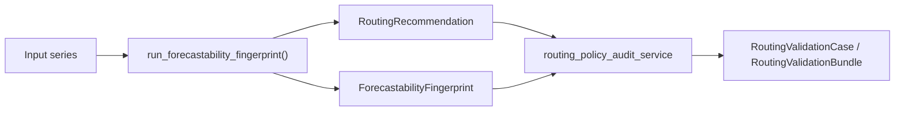

<!-- type: explanation -->
# Routing Validation

Routing validation is the deterministic release-hardening layer for the
v0.3.1 routing surface. It checks whether the existing routing policy emits
defensible family-level guidance on curated synthetic archetypes and, when the
required assets are present, on a small license-clear real-series panel.

> [!IMPORTANT]
> Routing validation does not train models and it is not a benchmark. It audits
> whether the current routing policy produces credible family-level guidance.
> A routed family is a downstream hand-off target, not an optimal-model claim.

## Position In The Stack

The live implementation is split across:

- `forecastability.use_cases.run_routing_validation`
- `forecastability.services.routing_policy_audit_service`
- `forecastability.services.routing_confidence_calibration_service`

## The Four Audit Outcomes

Let $\mathcal{F}_{obs}(r)$ be the observed primary families from the routing
recommendation, let $\mathcal{F}_{exp}(c)$ be the expected primary families for
a validation case, let $d_\theta(f)$ be the threshold-distance margin, and let
$S(f, r; \delta)$ be the rule-stability score. Each evaluated case receives
exactly one outcome:

$$
o(c, r) =
\begin{cases}
\texttt{abstain} & \text{if } |\mathcal{F}_{obs}(r)| = 0 \\
\texttt{pass} & \text{if } \mathcal{F}_{exp}(c) \cap \mathcal{F}_{obs}(r) \neq \emptyset \\
& \quad \text{and } d_\theta(f) \ge \tau_{margin}
\text{ and } S(f, r; \delta) \ge \tau_{stable} \\
\texttt{downgrade} & \text{if } \mathcal{F}_{exp}(c) \cap \mathcal{F}_{obs}(r) \neq \emptyset \\
& \quad \text{and } \big(d_\theta(f) < \tau_{margin}
\text{ or } S(f, r; \delta) < \tau_{stable}\big) \\
\texttt{fail} & \text{otherwise}
\end{cases}
$$

Plain-language semantics:

- `pass`: expected and observed families overlap, and the fingerprint is not
  sitting near a routing boundary.
- `downgrade`: expected and observed families overlap, but the evidence is too
  close to a policy threshold or too unstable under small perturbations.
- `fail`: expected and observed families do not overlap.
- `abstain`: the routing policy emits no primary families.

`downgrade` is deliberately not a failure. It preserves the direction of the
family-level hand-off while lowering confidence.

## Threshold-Distance Metric

The audit converts the active routing thresholds into a threshold vector and
measures how close the fingerprint is to the nearest policy boundary. With the
current routing surface, the threshold vector is built from:

- `low_mass_max = 0.03`
- `high_mass_min = 0.10`
- `high_nonlinear_share_min = 0.30`
- `high_directness_min = 0.60` when `directness_ratio` is available

For a fingerprint coordinate vector $f$ and thresholds $\theta$, the signed
normalised threshold-distance vector is:

$$
\widetilde{\Delta}_\theta(f) =
\left(
\frac{f_1 - \theta_1}{s_1},
\ldots,
\frac{f_K - \theta_K}{s_K}
\right)
$$

and the scalar audit margin is:

$$
d_\theta(f) = \min_i \left|\widetilde{\Delta}_{\theta, i}(f)\right|
$$

`RoutingPolicyAuditConfig.coordinate_scales` provides the per-coordinate
normalisation factors $s_i$. The default is `1.0`, which matches the current
fingerprint routing coordinates because they already live in $[0, 1]$.

Worked example with the current defaults:

| Coordinate | Fingerprint value | Threshold | Normalised distance |
| --- | ---: | ---: | ---: |
| `information_mass_low_max` | `0.11` | `0.03` | `0.08` |
| `information_mass_high_min` | `0.11` | `0.10` | `0.01` |
| `nonlinear_share` | `0.28` | `0.30` | `0.02` |
| `directness_ratio` | `0.58` | `0.60` | `0.02` |

The minimum distance is $d_\theta(f) = 0.01$. With the default
$\tau_{margin} = 0.05$, this is a boundary-hugging case: if the routed family
matches expectations it is still too close to the threshold fence to earn a
full `pass`.

> [!NOTE]
> Threshold distance is a routing-fragility metric, not a forecasting-quality
> metric. A small margin means the policy is near a decision boundary, not that
> the series is intrinsically unforecastable.

## Rule-Stability Score

The rule-stability score asks whether the routing decision survives small,
deterministic perturbations of the continuous routing coordinates. The current
implementation perturbs `information_mass`, `nonlinear_share`, and
`directness_ratio` when present, while leaving categorical structure labels
fixed.

For the active coordinate set $f$, the audit evaluates the deterministic
corner-plus-center grid:

$$
\hat{\mathcal{P}}_\delta(f) =
\{f + \delta e : e \in \{-1, +1\}^K\} \cup \{f\}
$$

and scores the share of grid points that preserve the center route:

$$
S(f, r; \delta) =
\frac{|\{f' \in \hat{\mathcal{P}}_\delta(f) :
\mathcal{F}_{obs}(\mathrm{route}(f')) = \mathcal{F}_{obs}(r)\}|}
{|\hat{\mathcal{P}}_\delta(f)|}
$$

Operationally:

- the center point is always included
- every sign-combination corner is evaluated exactly once
- coordinate keys are sorted before the grid is built, so the score is stable
  under dict insertion-order changes

With the current routing coordinates, the audit evaluates either $2^2 + 1 = 5$
or $2^3 + 1 = 9$ routing calls per case.

## Confidence Calibration

The calibrated `confidence_label` combines three signals:

- the existing routing penalty count `p`
- the threshold margin $d_\theta(f)$
- the rule-stability score $S(f, r; \delta)$

The decision table is evaluated top-to-bottom; the first matching row wins.

| Condition | Calibrated `confidence_label` |
| --- | --- |
| `primary_families` is empty | `abstain` |
| `p == 0` and `margin >= tau_margin` and `stability >= tau_stable_high` | `high` |
| `p <= 1` and `margin >= tau_margin_medium` and `stability >= tau_stable_medium` | `medium` |
| otherwise | `low` |

This is an additive widening of the existing `RoutingConfidenceLabel` surface:
the original `high`, `medium`, and `low` meanings stay intact, and `abstain`
is reserved for the no-primary-family case only.

## Versioned Scalars

`RoutingPolicyAuditConfig` pins the audit and calibration constants used by the
validation surface.

| Symbol | Default | Meaning |
| --- | ---: | --- |
| $\tau_{margin}$ | `0.05` | Minimum threshold margin for a `pass` outcome |
| $\tau_{margin, med}$ | `0.02` | Minimum threshold margin for `medium` confidence |
| $\tau_{stable}$ | `0.80` | Minimum stability score for a `pass` outcome |
| $\tau_{stable, high}$ | `0.95` | Minimum stability score for `high` confidence |
| $\tau_{stable, med}$ | `0.75` | Minimum stability score for `medium` confidence |
| $\delta$ | `0.05` | Perturbation radius used by the rule-stability grid |
| $s_i$ | `1.0` by default | Per-coordinate normalisation scale for threshold distance |

Any change to these scalars requires a regression-fixture refresh under
`docs/fixtures/routing_validation_regression/expected/`.

## Downstream Consumption

The public routing-validation use case returns a `RoutingValidationBundle`
containing per-case outcomes, the aggregate audit summary, and the exact
versioned config used for the run. The next release consumes the calibrated
`confidence_label` downstream when it prepares framework-facing hand-off
contracts; see the [v0.3.4 Forecast Prep Contract plan](../plan/v0_3_4_forecast_prep_contract_ultimate_plan.md).
