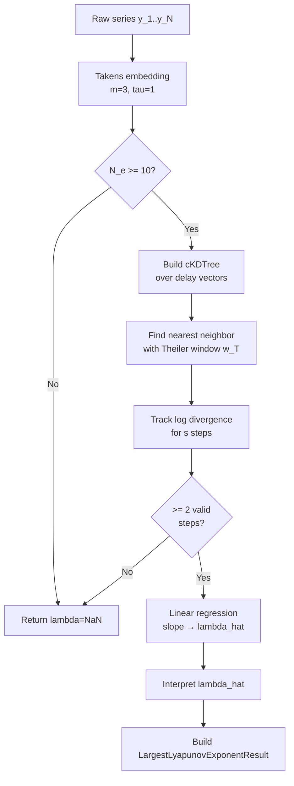

<!-- type: explanation -->

# Largest Lyapunov Exponent (F5)

> [!WARNING]
> **Experimental feature.** The LLE estimate must **not** be used as a sole triage
> decision-maker.  It is sensitive to noise, non-stationarity, and embedding
> parameters.  Always combine with AMI/pAMI evidence and the F6 complexity band.

The **Largest Lyapunov Exponent (LLE)**, denoted $\hat{\lambda}$, quantifies how
quickly nearby trajectories in a reconstructed phase space diverge over time.  A
positive $\hat{\lambda}$ is **consistent with** chaotic dynamics, but stochastic
noise and non-stationary processes can also produce positive $\hat{\lambda}$
estimates — this diagnostic alone cannot distinguish deterministic chaos from
stochastic divergence.  A negative value indicates **convergence** to a stable
attractor.

---

## 1. Takens Delay Embedding

Before estimating $\hat{\lambda}$ we reconstruct the phase space from the scalar
observations $y_1, y_2, \ldots, y_N$ using Takens' embedding theorem:

$$
\mathbf{x}_t = \bigl(y_t,\; y_{t+\tau},\; \ldots,\; y_{t+(m-1)\tau}\bigr)
\quad t = 1, \ldots, N - (m-1)\tau
$$

where

| Symbol | Default | Meaning |
|--------|---------|---------|
| $m$ | 3 | Embedding dimension |
| $\tau$ | 1 | Time delay (samples) |
| $N_e = N - (m{-}1)\tau$ | — | Number of delay vectors |

> [!CAUTION]
> **Sample size requirement.** Reliable phase-space coverage requires
> $n \gg 10^m$.  For the default $m=3$ this means $n \gg 1000$.
> Results for shorter series must be treated as **indicative only**.

---

## 2. Rosenstein Algorithm (1993)

This implementation follows **Rosenstein, Collins & De Luca (1993)**, which is the
preferred method for short, finite, noisy real-world series.  It avoids the
computational cost of full QR decomposition required by the Wolf algorithm.

### Step-by-step

1. **Embed** the series to obtain $N_e$ delay vectors $\{\mathbf{x}_i\}$.

2. **Find the nearest neighbor** $nn_i$ of each point $\mathbf{x}_i$ by minimum
   Euclidean distance, with **Theiler window** exclusion (see §3):

   $$|i - nn_i| > w_T$$

3. **Track log divergence** for $j = 0, 1, \ldots, s-1$ steps:

   $$d_j(i) = \bigl\|\mathbf{x}_{i+j} - \mathbf{x}_{nn_i+j}\bigr\|$$

4. **Average** the log distances over all valid pairs at each step:

   $$y(j) = \Bigl\langle \log d_j(i) \Bigr\rangle_i$$

5. **Fit a linear slope** to $y(j)$:

   $$\hat{\lambda} = \text{slope of } y(j) \text{ over } j = 0, \ldots, s-1$$

---

## 3. Theiler Window

Pairs of points that are close in **time** (not just in phase space) trivially
appear as near-neighbours due to temporal autocorrelation.  Including them would
bias $\hat{\lambda}$ downward.  The **Theiler window** excludes temporal neighbours:

$$w_T = \max\!\bigl(1, \lfloor 0.1 \cdot N \rfloor\bigr)$$

This heuristic excludes the nearest $10\%$ of the series on either side from the
nearest-neighbour search.  Larger values are safer for strongly autocorrelated
series.

---

## 4. Implementation Defaults

| Parameter | Default | Rule |
|-----------|---------|------|
| $m$ (embedding dim) | 3 | Conservative for typical financial/IoT lengths |
| $\tau$ (delay) | 1 | No a priori period information |
| $w_T$ (Theiler window) | $\max(1, \lfloor 0.1 N \rfloor)$ | 10% of series length |
| $s$ (evolution steps) | $\max(1, \lfloor N/20 \rfloor)$ | Adapts to series length |
| NN search | `scipy.spatial.cKDTree` | Fast and accurate |

---

## 5. λ Interpretation Table

| Condition | Interpretation |
|-----------|---------------|
| $\hat{\lambda} > 0.1$ | Positive divergence rate — consistent with chaotic dynamics (experimental) |
| $-0.1 \le \hat{\lambda} \le 0.1$ | Marginally stable or near-zero divergence |
| $\hat{\lambda} < -0.1$ | Converging trajectories (stable attractor region) |
| $\hat{\lambda} = \mathrm{NaN}$ | Insufficient data for reliable LLE estimation |

> **Note:** Purely stochastic series (white noise, AR processes) frequently satisfy
> $\hat{\lambda} > 0$ under Rosenstein estimation.  A positive $\hat{\lambda}$
> requires corroboration from AMI/pAMI and the F6 complexity band before inferring
> chaotic dynamics.

---

## 6. Algorithm Flowchart



---

## 7. Reliability Warnings

`LargestLyapunovExponentResult.reliability_warning` is **always** populated.  The
warning escalates when $n < 10^m$:

- **Short series warning**: `n < 10^m` — phase-space coverage is insufficient;
  the estimate is likely biased.
- **Standard warning**: even for adequate $n$, noise and non-stationarity degrade
  reliability; treat $\hat{\lambda}$ as a rough guide only.

---

## 8. Usage in Triage

F5 is a Stage 8 diagnostic appended to the triage result:

```python
result = run_triage(TriageRequest(series=series))
lle = result.largest_lyapunov_exponent  # LargestLyapunovExponentResult | None
if lle and lle.lambda_estimate > 0.1:
    print("Chaotic-like dynamics detected — consider nonlinear models")
```

The stage is wrapped in `try/except` so it **never crashes the triage pipeline**.
`result.largest_lyapunov_exponent` is `None` only when the stage raises unexpectedly.

F5 is gated behind `kind="diagnostic"` and `experimental=True` in the scorer
registry; production workflows should ignore it unless explicitly opted in.

---

## 9. References

- Rosenstein, M. T., Collins, J. J., & De Luca, C. J. (1993). **A practical method
  for calculating largest Lyapunov exponents from small data sets.**
  *Physica D: Nonlinear Phenomena*, 65(1–2), 117–134.
  <https://doi.org/10.1016/0167-2789(93)90009-P>

- Takens, F. (1981). **Detecting strange attractors in turbulence.**
  In D. Rand & L.-S. Young (Eds.), *Dynamical Systems and Turbulence, Lecture
  Notes in Mathematics*, 898, 366–381. Springer.

- Wang, Z., et al. (2025). **AMI forecastability analysis framework.**
  *(Internal reference — see `docs/theory/` for derivations.)*

- Theiler, J. (1986). **Spurious dimension from correlation algorithms applied
  to limited time-series data.** *Physical Review A*, 34(3), 2427–2432.
